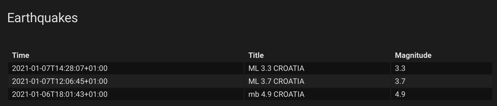

# EMSC Home Assistant Integration

Provides the European-Mediterranean Seismological Centre (EMSC) RSS feed to Home Assistant.

  

## Installation
Copy `custom_components/emscrss` to your `custom_components` folder in Home Assistant. Also available via HACS as a [custom repository](https://hacs.xyz/docs/faq/custom_repositories). See [info.md](info.md) for more information on usage.
